# RAG Text-to-SQL Flow

Everything that feeds RAG and what happens from **user question → output rows**. Focused on this pipeline only — not the whole repo.

---

## Overview

```text
PREREQUISITES (once)
    Neon DB + seed data
    → chunk schema per table
    → embed chunks → Pinecone index

PER QUESTION
    user question
    → embed + Pinecone search
    → rebuild schema for matched tables
    → LLM prompt → SQL → Neon → rows
```

**Without RAG:** full schema in every prompt.  
**With RAG:** only schema for tables similar to the question.

---

## Summary diagram — user question → output

One-page view of **Part 3 only** (assumes Neon is seeded and Pinecone is already indexed).

```mermaid
flowchart LR
    subgraph INPUT
        Q["① User question\n(natural language)"]
    end

    subgraph RAG["Retrieval (shrink schema)"]
        E["② OpenAI embed\n(text-embedding-3-large, 1024d)"]
        S["③ Pinecone search\ntop-k + cosine score"]
        T["④ Table names\n(e.g. employees, departments)"]
        B["⑤ build_schema_for_tables\n(read PK/columns/FK from Neon)"]
    end

    subgraph LLM["Generation"]
        P["⑥ Prompt\nretrieved_schema + examples + question"]
        G["⑦ OpenAI → SQL\n<thinking> + <sql>"]
    end

    subgraph EXEC["Execution"]
        R["⑧ run_sql\nSELECT only → Neon"]
        O["⑨ Output\ncolumns + rows"]
    end

    Q --> E --> S --> T --> B --> P --> G --> R --> O
```



**ASCII version (same path):**

```text
  USER QUESTION
       │
       ▼
  ┌─────────────┐     ┌──────────────┐     ┌─────────────────────┐
  │ OpenAI      │     │ Pinecone     │     │ Neon (SQLAlchemy    │
  │ embed query │ ──► │ similarity   │ ──► │ inspect)            │
  │ 1024-dim    │     │ search       │     │ rebuild schema for  │
  └─────────────┘     └──────────────┘     │ matched tables only │
                              │              └──────────┬──────────┘
                              │                         │
                              └──── table names ──────────┘
                                          │
                                          ▼
                               ┌──────────────────────┐
                               │ LLM prompt           │
                               │ <schema> (retrieved) │
                               │ <examples> + <query> │
                               └──────────┬───────────┘
                                          ▼
                               ┌──────────────────────┐
                               │ OpenAI               │
                               │ → <thinking> (debug) │
                               │ → <sql> (execute)    │
                               └──────────┬───────────┘
                                          ▼
                               ┌──────────────────────┐
                               │ run_sql on Neon      │
                               │ engine + text(sql)   │
                               └──────────┬───────────┘
                                          ▼
                               ┌──────────────────────┐
                               │ OUTPUT               │
                               │ tables retrieved     │
                               │ thinking, SQL, rows  │
                               └──────────────────────┘
```

| Step | What | Where |
|------|------|--------|
| ① | User asks in plain English | `basics_4_rag.py` `user_query` |
| ② | Question → vector | `VectorDB.embed_query()` |
| ③ | Vector → similar schema chunks | `VectorDB.search()` |
| ④ | Extract `metadata.table` from matches | `retrieve_schema_for_question()` |
| ⑤ | Full schema text for those tables only | `build_schema_for_tables()` |
| ⑥ | Small schema + question → prompt | `generate_prompt_with_cot()` |
| ⑦ | Prompt → thinking + SQL | `generate_sql()` + `parse_llm_response()` |
| ⑧ | Run SELECT on Postgres | `run_sql(engine, sql)` |
| ⑨ | Print/display results | `columns`, `rows` |

---

## Part 0 — Prerequisites (do this before RAG works)

### 0.1 Create the database on Neon

Neon already gives you a Postgres database. Python does **not** create Neon itself — it **creates tables and seed rows** inside it.

**Script:** `T2S/db/create_db_sqlalchemy.py`

```text
load DATABASE_URL from .env
    → create_engine (SQLAlchemy + pool_pre_ping)
    → engine.begin(): CREATE TABLE IF NOT EXISTS departments, employees
    → if departments empty: INSERT 10 departments + 200 employees
    → engine.connect(): verify counts
```

**Tables:**

| Table | Key columns | Notes |
|-------|-------------|--------|
| `departments` | `id`, `name`, `location` | 10 rows (HR, Engineering, …) |
| `employees` | `id`, `name`, `age`, `department_id`, `salary`, `hire_date` | 200 rows |
| **FK** | `employees.department_id` → `departments.id` | Important for JOIN questions |

**Run once:**

```bash
python T2S/db/create_db_sqlalchemy.py
```

Second run skips seed if data already exists.

**Why this matters for RAG:** Chunks are built from **live schema** in this DB. Empty or wrong DB → wrong or empty chunks.

---

### 0.2 Pinecone index

Created in Pinecone console:

| Setting | Our value |
|---------|-----------|
| Index name | `t2s-schema` (`PINECONE_INDEX_NAME` in `.env`) |
| Dimensions | **1024** |
| Metric | cosine |
| Embedding model | `text-embedding-3-large` |

**`.env` needs:**

```bash
DATABASE_URL=postgresql://...
OPENAI_API_KEY=sk-...
PINECONE_API_KEY=pcsk_...
PINECONE_INDEX_NAME=t2s-schema
```

---

### 0.3 SQLAlchemy connection (used everywhere)

```python
engine = create_engine(DATABASE_URL, pool_pre_ping=True)
```

- **`inspect(engine)`** — read tables/columns/PK/FK (chunking)
- **`engine.connect()` + `text(sql)`** — run generated SELECTs
- **`engine.begin()`** — only in seed script for CREATE/INSERT

---

## Part 1 — Chunking (how schema becomes RAG documents)

**File:** `T2S/rag/schema_chunks.py`  
**When:** Indexing (and again after search to rebuild prompt text)

### 1.1 Tutorial vs our chunking

| Tutorial (SQLite) | Our approach (Neon) |
|-------------------|---------------------|
| One chunk **per column**: `"Table: X, Column: Y, Type: Z"` | One chunk **per table** |
| `sqlite_master` + `PRAGMA table_info` | SQLAlchemy `inspect(engine)` |
| Stored in pickle | Embedded → Pinecone |

**Why per table?** Text-to-SQL retrieval picks **tables** (`employees`, `departments`), not individual columns. Each chunk is a full table description the LLM can use for JOINs.

### 1.2 How one chunk is built — `_build_table_text()`

For each table in `public` schema, read from Neon:

1. **Table name** — `Table: employees`
2. **Primary key** — `Primary key: id`
3. **Every column** — `- name (TEXT)`, `- salary (NUMERIC)`, …
4. **Foreign keys** — `(department_id) -> departments(id)`

**Example chunk text (what gets embedded):**

```text
Table: employees
  Primary key: id
  - id (INTEGER)
  - name (TEXT)
  - age (INTEGER)
  - department_id (INTEGER)
  - salary (NUMERIC(12, 2))
  - hire_date (DATE)
  Foreign keys:
    - (department_id) -> departments(id)
```

FK lines in the chunk help even when Pinecone only retrieves `employees` — the model still knows to JOIN `departments`.

### 1.3 `build_schema_chunks(engine)` — output shape

Returns a **list** (one item per table):

```python
{
    "text": "Table: employees\n  Primary key: id\n ...",   # → sent to OpenAI embed
    "metadata": {
        "table": "employees",
        "kind": "technical",   # later: separate "business" chunks
    },
}
```

For our DB: **2 chunks** (`departments`, `employees`).

**We are not inventing data** — text is generated from whatever `inspect()` sees in Neon right now.

**Smoke test (no Pinecone):**

```bash
python T2S/rag/schema_chunks.py
```

### 1.4 `build_schema_for_tables(engine, table_names)` — after search

Same `_build_table_text()` logic, but only for tables Pinecone returned.

Used **after** retrieval to build the `<schema>` block in the prompt — always **fresh from Neon**, not from Pinecone stored text.

---

## Part 2 — Embedding and indexing (Pinecone)

**File:** `T2S/rag/pinecone_db.py`  
**When:** First run (or after schema change)

### 2.1 Tutorial vs our storage

| Tutorial | Us |
|----------|-----|
| VoyageAI `embed()` | OpenAI `text-embedding-3-large` + `dimensions=1024` |
| Save vectors in `vector_db.pkl` | `index.upsert()` to Pinecone |
| `np.dot` for similarity | `index.query()` |

### 2.2 `VectorDB.load_data(chunks)` — step by step

```text
1. texts = [chunk["text"] for chunk in chunks]
2. OpenAI embeddings.create(model=large, input=texts, dimensions=1024)
       → list of vectors (each 1024 floats)
3. For each chunk:
       id       = "employees-technical"
       values   = embedding vector
       metadata = { "table": "employees", "kind": "technical" }
4. index.upsert(vectors)
```

**We do not store full schema text in Pinecone metadata** — only `table` + `kind`. Size limits; Neon rebuilds full text via `build_schema_for_tables`.

**Re-index:** Running `load_data` again with same ids **overwrites** vectors.

### 2.3 Check index is ready

```python
vectordb.vector_count()  # expect 2 for our DB
```

Or:

```bash
python T2S/rag/pinecone_db.py   # smoke test: index + sample search
```

`basics_4_rag.py` calls `ensure_index_populated()` — upserts only if count is 0.

---

## Part 3 — Per question: user input → output rows

**File:** `T2S/rag/basics_4_rag.py`

### 3.1 User asks a question

Example:

> What are the names and hire dates of employees in the Engineering department, ordered by salary?

Used in **both** Pinecone search and LLM `<query>` block.

---

### 3.2 Embed the question

Inside `VectorDB.search()` → `embed_query(user_query)`:

```text
question string  →  OpenAI embed (same model, dimensions=1024)  →  query vector
```

Must match indexing model/dimensions or similarity scores are meaningless.

---

### 3.3 Pinecone similarity search

```text
query vector  compared to  all index vectors  (cosine)
    → top_k matches (default k=3)
    → drop if score < similarity_threshold (default 0.3)
```

Each match:

```python
{ "metadata": {"table": "employees", "kind": "technical"}, "similarity": 0.397 }
```

Extract table names (deduped, order preserved):

```python
retrieved_tables = ["employees", "departments"]  # ideal case
```

---

### 3.4 Rebuild schema for retrieved tables only

```python
retrieved_schema = build_schema_for_tables(engine, retrieved_tables)
```

Pinecone answered **which tables**; Neon provides **full column/PK/FK text** for the prompt.

---

### 3.5 RAG lineage (debug)

Log before LLM call:

- question
- `retrieved_tables`

Answers: *what context did the model get?*

Optional: compare `len(full_schema)` vs `len(retrieved_schema)` — RAG saves tokens when you have many tables.

---

### 3.6 LLM prompt

```python
prompt = generate_prompt_with_cot(schema=retrieved_schema, query=user_query)
```

| Block | Content |
|-------|---------|
| `<schema>` | Retrieved tables only |
| `<examples>` | Few-shot with `<thinking>` + `<sql>` |
| `<query>` | User question |

---

### 3.7 LLM → SQL

```text
OpenAI  →  <thinking>...</thinking>  +  <sql>...</sql>
```

- **thinking** — read for debugging  
- **sql** — only this runs on Neon  

---

### 3.8 Execute on Neon

```text
run_sql(engine, sql)
    → reject if not SELECT
    → engine.connect()
    → conn.execute(text(sql))
    → columns, rows
```

---

### 3.9 Output

- Retrieved tables  
- Thinking  
- SQL  
- Row data  

```text
columns: ['name', 'hire_date']
('Jane White', 2020-12-30)
...
```

---

## Full pipeline diagram

```text
┌─── ONE-TIME SETUP ───────────────────────────────────────────────────┐
│  create_db_sqlalchemy.py  →  Neon: departments + employees         │
│  build_schema_chunks()    →  2 text chunks                         │
│  VectorDB.load_data()     →  OpenAI embed → Pinecone upsert        │
└────────────────────────────────────────────────────────────────────┘
                                    │
┌─── EVERY QUESTION ──────────────────▼────────────────────────────────┐
│  User question                                                       │
│      → embed_query                                                 │
│      → Pinecone search → table names                               │
│      → build_schema_for_tables (Neon) → retrieved_schema           │
│      → prompt(retrieved_schema, question)                          │
│      → LLM → sql                                                     │
│      → run_sql → rows                                                │
└────────────────────────────────────────────────────────────────────┘
```

---

## Indexing vs querying

| | Indexing | Querying |
|---|----------|----------|
| **When** | Once / schema change | Every question |
| **Input** | All tables from Neon | User question string |
| **Output** | Vectors in Pinecone | SQL + rows |
| **Key functions** | `build_schema_chunks`, `load_data` | `search`, `build_schema_for_tables` |

---

## Retrieval gotcha

Pinecone may return only `employees` (not `departments`) if scores differ. SQL can still work when the **employees chunk includes the FK** to `departments`.

If a needed table is missing and there is no FK hint → wrong SQL. Mitigations: lower threshold, increase `k`, auto-add FK-linked tables.

---

## Commands (this pipeline only)

```bash
# 1. Seed Neon
python T2S/db/create_db_sqlalchemy.py

# 2. Verify chunks
python T2S/rag/schema_chunks.py

# 3. Index + test search
python T2S/rag/pinecone_db.py

# 4. Full RAG ask → SQL → results
python T2S/rag/basics_4_rag.py
```

---

## Files in this pipeline

| File | Role |
|------|------|
| `db/create_db_sqlalchemy.py` | Create tables + seed Neon |
| `rag/schema_chunks.py` | Chunking + rebuild schema for prompt |
| `rag/pinecone_db.py` | Embed, upsert, search |
| `rag/basics_4_rag.py` | Wire question → output |

---

## Summary

**Setup:** Seed Neon with HR data. **Chunk** each table’s schema (PK, columns, FKs) into text. **Embed** with OpenAI (1024-dim large) and **upsert** to Pinecone with table metadata.

**Per question:** Embed the question, **search** Pinecone for similar tables, **rebuild** schema text from Neon for those tables only, **prompt** the LLM, **run** SELECT on Neon, return rows. RAG’s job is shrinking schema context before the LLM sees it.
